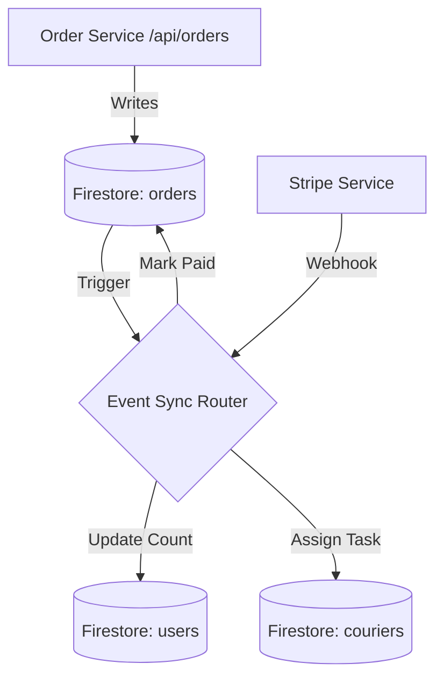

# WashEase Synchronized Data Architecture

## Overview
This system uses a **Database-per-Service** pattern, meaning each domain (Orders, Users, Couriers) owns its own Firestore collection. Synchronization is handled via **Event Traps** (Firestore Triggers) to ensure loose coupling and high scalability.

## Data Flow Diagram

## Synchronization Mechanisms
1. **Firestore Triggers**: Automatic, server-side code that runs when data changes.
2. **Exponential Backoff**: For external API syncs (e.g., Stripe) to handle transient failures.
3. **Optimistic UI**: Use Firestore listeners on the client to show "near real-time" updates before the sync finishes.

## Sync Rulebook
- **Orders** are the "Source of Truth" for status.
- **Users** contain a denormalized cache of their recent 5 orders for performance.
- **Failures** are logged to a `sync_errors` collection for manual replay or retry.
